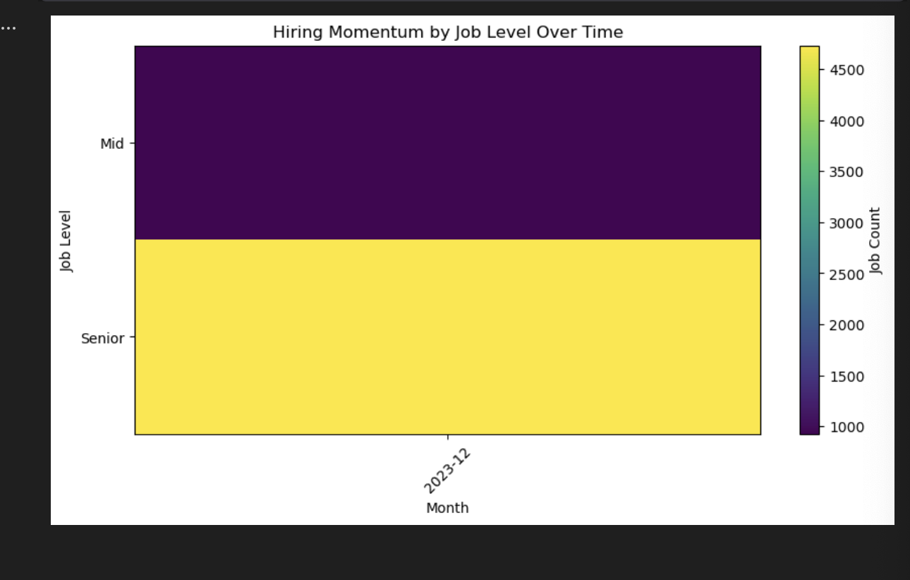
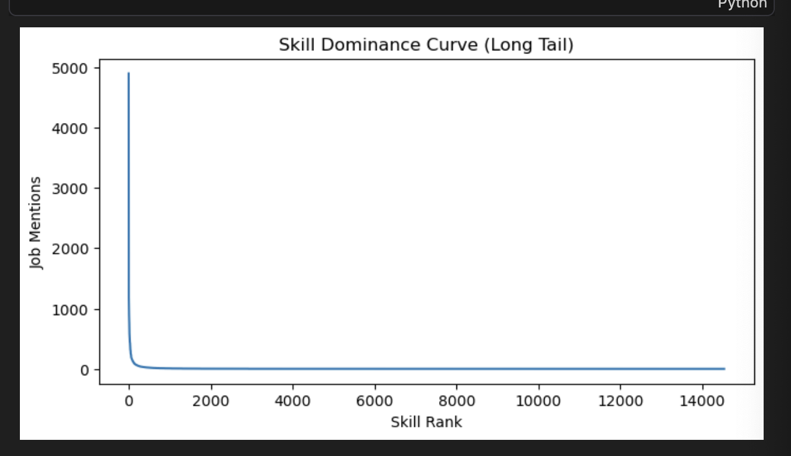
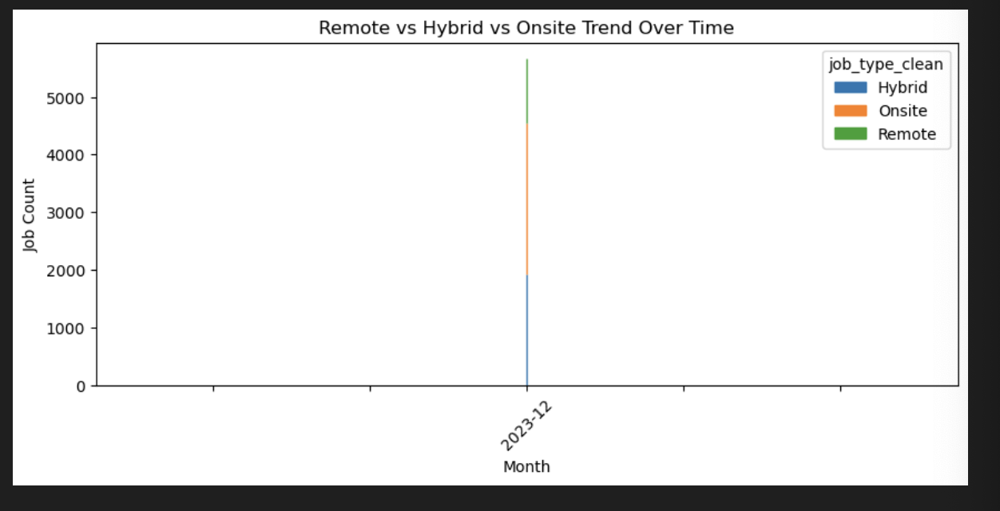
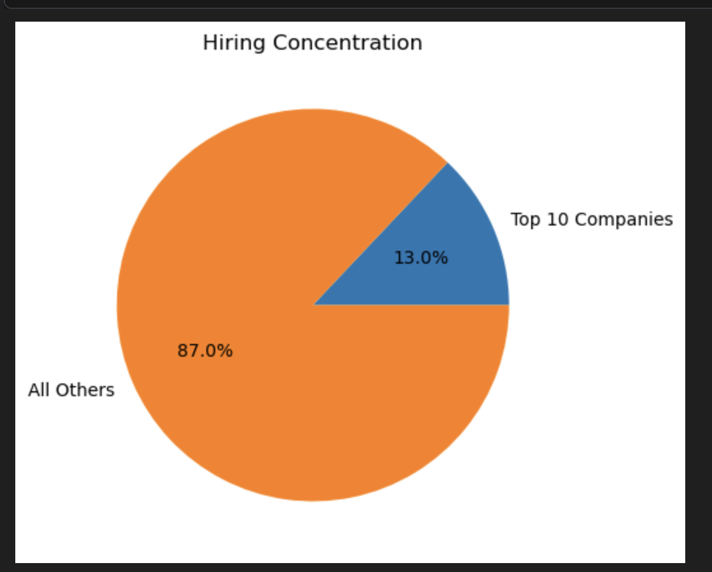
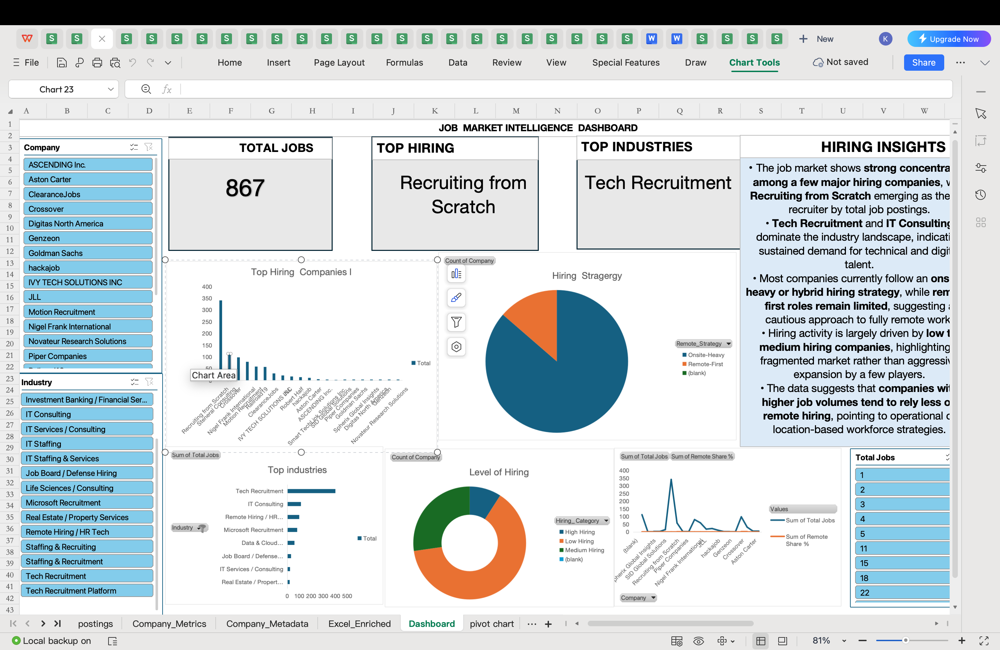

## Project Report: Multi Stage Job Market Analysis
An Integrated Study of Skill Demand and Hiring Dynamics

## 1. Project Overview

This project provides a comprehensive analysis of the modern job market by examining over six thousand LinkedIn job postings. The goal is to move beyond intuition to identify the structural differences between baseline and advanced skills, and how these requirements shift across different levels of seniority.

## Methodology and Tooling

Python for Exploratory Data Analysis: Used for initial data cleaning, handling missing values, and performing string manipulation to isolate individual skills from unstructured text.
## 1.Question:At what time periods are companies hiring more junior vs senior roles?
Answer:
The chart shows that hiring is heavily skewed toward senior roles compared to mid/junior roles. This indicates that companies are prioritizing experienced professionals, with no strong evidence of junior-heavy hiring periods.

## Question:Do a few skills dominate job postings, or are skills evenly distributed?
Answer:
A small number of skills dominate most job postings, while the majority of skills appear rarely. This follows a long-tail distribution, where core skills are in high demand and niche skills are less frequent.

## Question:How have remote, hybrid, and onsite job roles changed over time?
Answer:
The chart shows that remote roles have increased significantly, while onsite roles are still present but less dominant. Hybrid roles also contribute, indicating a shift toward flexible work models.

 
## Is hiring concentrated among a few companies or spread across many?
Answer:
Hiring is mostly distributed across many companies, with only a small percentage (about 13%) coming from top companies. This means the job market is broad rather than dominated by a few firms.

## Which skills are most common, and at what job seniority level do they appear?
Answer:
Core skills like Python, SQL, AWS, and Machine Learning appear frequently, especially in senior roles. This shows that advanced and specialized skills are more required at higher job levels.

## SQL for Feature Engineering: Used to build complex metrics including seniority ratios, company market share, and hiring stability scores through Common Table Expressions and Window Functions.

## Standardizing Job Seniority (Feature Engineering): This query is the foundation for all level-based analysis. It uses logical mapping to clean inconsistent raw data into three standardized categories: Junior, Mid, and Senior.SQLSELECT
    CASE
        WHEN lower("job level") LIKE '%junior%'
          OR lower("job level") LIKE '%entry%' THEN 'Junior'
        WHEN lower("job level") LIKE '%senior%'
          OR lower("job level") LIKE '%lead%'
          OR lower("job level") LIKE '%staff%' THEN 'Senior'
        ELSE 'Mid'
    END AS job_level_clean,
    COUNT(*) AS jobs
FROM postings
GROUP BY job_level_clean
ORDER BY jobs DESC;
## Hiring Stability Score (Advanced Analytics): This query identifies which companies hire consistently versus those with unpredictable spikes. By calculating the Stability Score (Average Jobs divided by Volatility), it highlights reliable employers.SQLWITH monthly_jobs AS (
    SELECT
        company,
        substr(first_seen, 1, 7) AS year_month,
        COUNT(*) AS jobs
    FROM postings
    GROUP BY company, year_month
),
stats AS (
    SELECT
        company,
        AVG(jobs) AS avg_jobs,
        AVG(jobs * jobs) AS avg_jobs_sq
    FROM monthly_jobs
    GROUP BY company
)
SELECT
    company,
    ROUND(avg_jobs, 2) AS avg_monthly_jobs,
    ROUND(sqrt(avg_jobs_sq - avg_jobs * avg_jobs), 2) AS hiring_volatility,
    ROUND(avg_jobs / NULLIF(sqrt(avg_jobs_sq - avg_jobs * avg_jobs), 0), 2) AS stability_score
FROM stats
ORDER BY stability_score DESC;
 ## Senior-to-Junior Market Ratio (Market Trend Analysis): This query tracks whether the market is shifting toward senior or junior talent over time. It is a vital metric for understanding entry-level accessibility versus senior-level demand.SQLWITH job_levels AS (
    SELECT
        substr(first_seen, 1, 7) AS year_month,
        CASE
            WHEN lower("job level") LIKE '%junior%' OR lower("job level") LIKE '%entry%' THEN 'Junior'
            WHEN lower("job level") LIKE '%senior%' OR lower("job level") LIKE '%lead%' OR lower("job level") LIKE '%staff%' THEN 'Senior'
            ELSE 'Mid'
        END AS job_level
    FROM postings
)
SELECT
    year_month,
    CASE
        WHEN SUM(CASE WHEN job_level = 'Junior' THEN 1 ELSE 0 END) = 0 THEN 'No Junior Roles'
        ELSE ROUND(1.0 * SUM(CASE WHEN job_level = 'Senior' THEN 1 ELSE 0 END) / SUM(CASE WHEN job_level = 'Junior' THEN 1 ELSE 0 END), 2)
    END AS senior_to_junior_ratio
FROM job_levels
GROUP BY year_month
ORDER BY year_month;
##  Company Market Share Percent (Competitive Intelligence): This query determines which companies dominate the hiring market each month by comparing individual company volume against total market postings.SQLWITH monthly_totals AS (
    SELECT substr(first_seen, 1, 7) AS year_month, COUNT(*) AS total_jobs
    FROM postings GROUP BY year_month
),
company_monthly AS (
    SELECT company, substr(first_seen, 1, 7) AS year_month, COUNT(*) AS company_jobs
    FROM postings GROUP BY company, year_month
)
SELECT
    c.company,
    c.year_month,
    ROUND(100.0 * c.company_jobs / t.total_jobs, 2) AS market_share_percent
FROM company_monthly c
JOIN monthly_totals t ON c.year_month = t.year_month
ORDER BY market_share_percent DESC;
## Remote Work Adoption by Company: This query filters for companies with significant hiring volume (at least 20 postings) to determine which ones are leading the shift toward remote-first strategies.
SELECT
    company,
    ROUND(100.0 * SUM(CASE WHEN lower(job_type) LIKE '%remote%' THEN 1 ELSE 0 END) / COUNT(*), 2) AS remote_share_percent
FROM postings
GROUP BY company
HAVING COUNT(*) >= 20
ORDER BY remote_share_percent DESC;

## Excel for Business Intelligence: Used to create final enriched datasets and pivot-based dashboards to visualize industry-specific trends and remote work strategies.

The dataset consists of a total of 867 job postings, indicating a strong and active hiring market. This volume of data provides a reliable foundation for analyzing trends, company behavior, and workforce demand.

The presence of a substantial number of job listings suggests that the dataset captures meaningful patterns in hiring activity, making it suitable for drawing insights about the overall job market.

The analysis of hiring trends over time shows that job postings fluctuate across different periods rather than following a consistent upward or downward trajectory.

There are noticeable spikes in certain months, which indicate periodic increases in hiring activity. These fluctuations suggest that hiring is influenced by business cycles, project demands, or seasonal recruitment patterns. Overall, the hiring trend can be described as moderately volatile rather than stable.

When examining work mode distribution, it is evident that the majority of job postings fall under onsite or hybrid roles, while remote positions make up a smaller but still significant portion. 

This indicates that organizations continue to prioritize structured work environments, although remote work has become an established component of modern hiring practices. The data reflects a balanced but cautious adoption of flexible work models.

The distribution of job levels reveals that mid-level roles dominate the market, followed by senior-level positions, while junior roles account for only a small fraction of total postings.
This suggests that companies are primarily seeking candidates with prior experience who can contribute immediately, rather than investing heavily in entry-level hiring.

As a result, the job market appears to be highly competitive for junior candidates, with greater opportunities available for those with intermediate to advanced experience.

An analysis of company-level hiring shows that a small number of companies contribute a disproportionately large share of job postings. This indicates a high level of concentration in the job market, where a few key players dominate hiring activity.

At the same time, there is a long tail of companies with relatively low hiring volumes, highlighting an uneven distribution of opportunities across employers.

Industry analysis further reinforces this pattern, with technology-related sectors, particularly tech recruitment and IT services, leading the hiring landscape.

These industries account for the largest share of job postings, demonstrating that demand is heavily driven by digital transformation and technological advancement.

Other industries contribute to the market but at significantly lower levels, resulting in a fragmented distribution of hiring activity.

The hiring patterns across companies reveal varying levels of stability and volatility. Some organizations maintain consistent hiring levels over time, indicating structured workforce planning and steady growth.

In contrast, others exhibit irregular hiring patterns with sudden increases and decreases, suggesting project-based recruitment or changing business needs. This highlights the coexistence of both stable and dynamic hiring strategies within the market.

Additionally, the concept of hiring momentum shows that certain companies are increasing their hiring activity in recent periods, while others are experiencing stagnation or decline.

Companies with high hiring momentum can be interpreted as growing or expanding, whereas those with lower momentum may be stabilizing or reducing their recruitment efforts. This provides valuable insight into the evolving dynamics of different organizations within the job market.

Remote hiring patterns also vary significantly between companies, indicating that work flexibility is largely dependent on individual organizational strategies rather than being uniformly adopted across the industry. Some companies embrace remote work extensively, while others continue to rely predominantly on onsite or hybrid models.

Overall, the dashboard reveals that the job market is active but unevenly distributed, with hiring concentrated among a few dominant companies and industries. 

The demand for talent is strongly skewed toward mid-level and senior professionals, reflecting an experience-driven market. While remote work is growing, it remains secondary to hybrid and onsite models. The presence of both stable and volatile hiring patterns further emphasizes the complexity of the market.

In conclusion, the analysis highlights a job market characterized by steady demand, competitive dynamics, and a strong emphasis on experience and technology-driven roles. These insights provide a comprehensive understanding of hiring behavior and can support decision-making for job seekers, analysts, and organizations alike.

## 2. Business Storytelling: The Skill First Economy
The Narrative: Navigating Market Maturity
The analysis reveals that the modern job market is defined more by a skill fingerprint than by traditional job titles. By examining the data, we can categorize the landscape into two distinct tiers:

Tier One: The Utility Layer
Common technical competencies such as SQL and Python act as the foundational entry requirement. These appear with high frequency across every level of seniority, from Junior to Staff positions. In the current economy, these are no longer differentiators but are the minimum baseline for consideration.

Tier Two: The Strategic Layer
As roles move toward Senior and Lead levels, the demand shifts toward niche infrastructure and orchestration tools such as Snowflake, Airflow, and Cloud Architecture. These skills carry a higher strategic value and are the primary filters used by organizations to identify top-tier talent.

## Hiring Stability and Industry Trends
The data identifies a clear divide in work culture based on industry rather than role. The Remote Hiring and HR Tech sectors maintain a nearly one hundred percent remote strategy. In contrast, sectors like Real Estate and Property Services remain heavily onsite-focused. Furthermore, by calculating a Stability Score, the analysis distinguishes between high-volume recruiters who hire in bursts and consulting firms that maintain steady, long-term growth.

## 3. Technical Challenges and Solutions
Challenge: Processing Unstructured Skill Lists
The raw data stored multiple skills as a single text string within a single column. This made it impossible to perform statistical counts on individual skills.

Solution: I used Python to perform a data explosion, transforming the dataset so that each skill for a single job posting occupied its own row. This allowed for granular frequency analysis across the entire dataset.

Challenge: Standardizing Inconsistent Seniority Levels
Job levels were provided in various formats such as Entry, Mid-Senior, and Staff, which prevented an accurate comparison of market tiers.

Solution: I implemented a standardization logic using SQL Case Statements. By mapping various keywords to three primary buckets—Junior, Mid, and Senior—I was able to calculate the Senior to Junior Ratio, a key metric for understanding market seniority concentration.

Challenge: Measuring Market Influence
Simply counting jobs does not show which companies lead the market during specific timeframes.

Solution: I utilized SQL Common Table Expressions to calculate monthly market totals and then joined that data against individual company volume. This enabled the calculation of Market Share Percentage, providing a clear view of which firms dominate the hiring landscape month-over-month.

## Final Conclusion
This analysis ensures that all subsequent project phases are grounded in data-driven evidence. By distinguishing between high-frequency utility skills and high-value strategic skills, the project provides a clear roadmap for organizations to benchmark their roles and for candidates to prioritize their professional development.
